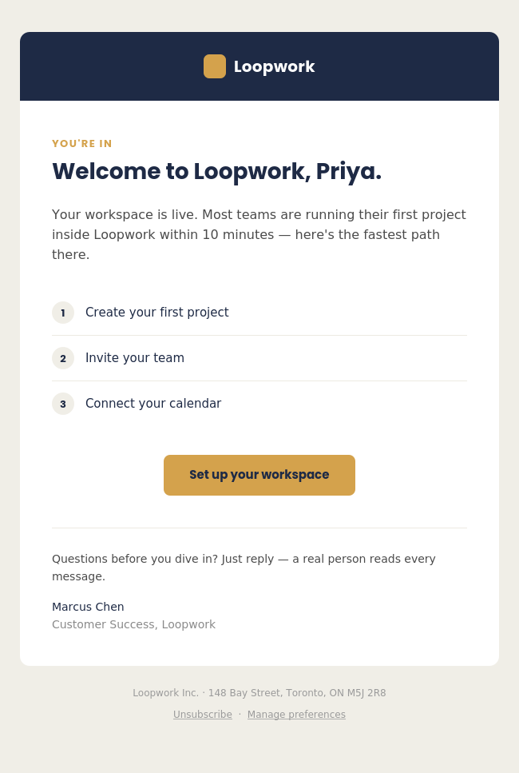
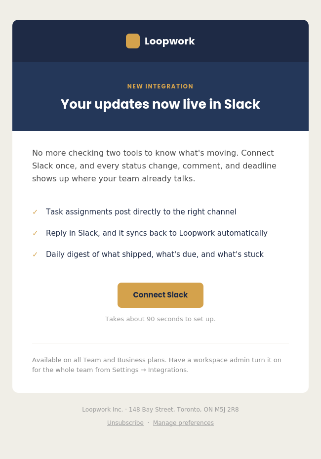
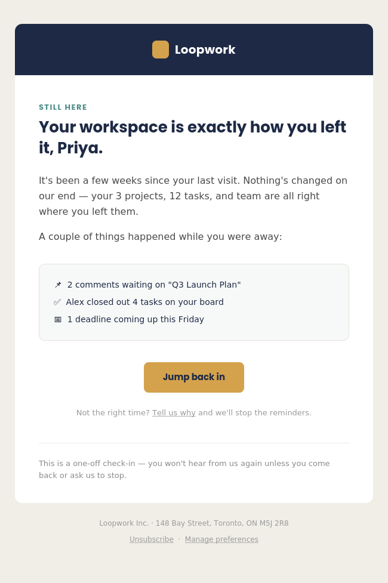
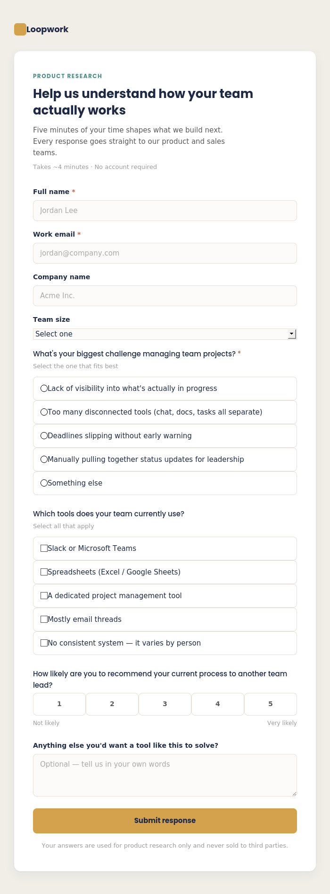

# Sneha Ann George — Marketing Technology Portfolio

Hands-on samples of marketing automation, CRM, and AI-powered systems work, built to demonstrate practical skills alongside my HubSpot certifications (HubSpot Marketing Hub Software Certified, HubSpot Inbound Marketing Certified) and Salesforce Administrator certification preparation (Salesforce Trailhead, 21 badges).

**Contact:** snehaanngeorge.ca@gmail.com · [LinkedIn](https://linkedin.com/in/sneha-ann-george)

---

## Case Study: AI Lead Follow-Up Assistant

A working tool that reads CRM lead data, autonomously decides which leads need follow-up based on engagement rules, and drafts personalized outreach emails by calling the Claude API directly in code — not through a chat interface.

This is built to demonstrate the specific distinction between *using* AI conversationally and *building with* AI programmatically: the tool makes real decisions (which leads qualify, which get flagged for human review, which are skipped as too new) and generates contextual output as part of an automated process a team could actually run.

### What's in this case study

| File | Purpose |
|---|---|
| [`lead-followup-assistant/lead_followup_assistant.py`](lead-followup-assistant/lead_followup_assistant.py) | Main script — reads leads, applies decision rules, calls the Claude API to draft emails |
| [`lead-followup-assistant/sample_leads.csv`](lead-followup-assistant/sample_leads.csv) | Sample CRM lead export used to test the tool |
| [`lead-followup-assistant/SAMPLE_RUN.md`](lead-followup-assistant/SAMPLE_RUN.md) | Unedited output from an actual successful run, showing real drafted emails |
| [`lead-followup-assistant/README.md`](lead-followup-assistant/README.md) | Full technical writeup of the project |

### Why this demonstrates building with AI, not just using it

- **Programmatic API usage** — the script calls `anthropic.Anthropic().messages.create()` directly in code, with no chat interface involved.
- **Autonomous decision-making** — the tool applies real business rules to decide *which* leads to act on (skipping brand-new leads, flagging cold leads for human review, only drafting for leads that qualify), not just generating text on request.
- **Reusable, not one-off** — any marketer could point this script at their own exported lead list and get the same automated triage and drafting.

See the [full case study README](lead-followup-assistant/README.md) for technical details, and [SAMPLE_RUN.md](lead-followup-assistant/SAMPLE_RUN.md) for real, unedited output from a successful run.

---

## Case Study: Loopwork — Email Marketing & Lead Capture

A self-directed sample project: coded responsive HTML emails, lifecycle/behavioral email strategy, and a lead-capture research form.

**Loopwork** is a fictional B2B SaaS product used here purely as a design and copy vehicle — no real company, client data, or brand assets are used. All code, copy, and design decisions are original.

### What's in this case study

| File | Purpose | Buyer/customer stage |
|---|---|---|
| [`emails/email-01-welcome.html`](emails/email-01-welcome.html) | Day-0 onboarding email | New signup |
| [`emails/email-02-feature-announcement.html`](emails/email-02-feature-announcement.html) | Product/feature launch email | Active customer |
| [`emails/email-03-reengagement.html`](emails/email-03-reengagement.html) | Behavioral win-back email (21-day inactivity trigger) | Lapsed/at-risk customer |
| [`forms/survey-form.html`](forms/survey-form.html) | Product research / sales-enablement survey | Lead generation |

### Why these four pieces together

- The **survey form** represents the kind of market-research capture used to inform segmentation and messaging — the same pattern used for structured lead data collection from sales agents in a past role.
- The **welcome email** covers the acquisition/onboarding trigger.
- The **feature announcement** covers ongoing lifecycle engagement for active users.
- The **re-engagement email** covers behavioral remarketing — re-targeting based on inactivity, a technique used in production for SendGrid-based customer journeys.

### Screenshots

<table>
<tr>
<td> Welcome email</td>
<td> Feature announcement</td>
<td> Re-engagement email</td>
</tr>
</table>

 Survey form

### Technical notes

**Emails** are built as production-style HTML email, not modern web HTML:
- Table-based layout (`role="presentation"` tables), not flexbox/grid — required for consistent rendering across Outlook, Gmail, and Apple Mail
- Inline and embedded styles with MSO conditional comments for Outlook compatibility
- Hidden preheader text for inbox preview lines
- "Bulletproof" button technique (padded table cell, not just a styled `<a>` tag) for reliable rendering in Outlook
- Mobile-responsive via media queries, with a 600px max-width container
- Every CTA link includes UTM parameters (`utm_source`, `utm_medium`, `utm_campaign`) for campaign attribution

**Survey form** uses semantic HTML (`fieldset`/`legend` grouping, required-field indicators) for accessibility, and modern CSS since it's a standard web page rather than an email client target.

### How to view

Open any `.html` file directly in a browser, or view the screenshots above.
